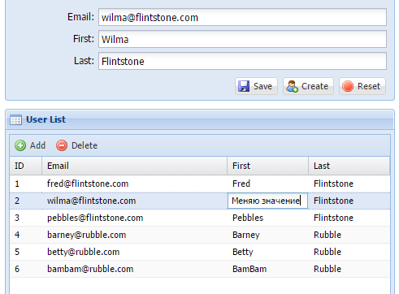

<h1 class="western">Задача 1</h1>
<h2 class="western">Функциональная постановка</h2>

 Написать одно веб-приложение. Функционально должен быть 1 веб-интерфейс (html-страница), состоящий из списка заявок (абстрактных) и панели детализации каждой заявки. При выборе заявки из списка данные обновляются в панели детализации. Поля для сущности заявки: номер, наименование, кому, от кого, статус. Кому, от кого и статус &ndash; справочники, элементы можно захардкодить.

Должна быть доступна возможность редактирования списка: создать, редактировать, удалить заявку.На сервере писать переданные значения в System.out с наименованием операции (только для цели проверки, логгирования). При этом выбор значений справочников на интерфейсе должен осуществляться из комбобоксов (а список элементов справочников, соответственно, приходить с сервера).

<h2 class="western">Технологии к использованию</h2>

Клиентская часть на ExtJS 4+, серверная часть на Spring MVC без подключения БД (все данные можно захардкодить). Желательно использовать IDE Eclipse + Maven. Во всем остальном предоставляется свобода выбора.

<h2 class="western">Результат</h2>

Результат должен представлять собой один архив веб-приложения (.war, например) с указанием сервера приложений и его версии (обязательно), на котором его можно развернуть и запустить. При этом процесс развертывания приложения должен быть максимально прост, никаких доп. настроек. Также рекомендуется указать URL по которому можно проверить результат, если он не дефолтный (не index.html, например).

<h2 class="western">Пример интерфейса</h2>

 Примерный интерфейс, который должен получиться, приведен ниже. Нет необходимости точно придерживаться приведенного примера - расхождения, скорее, приветствуются. Красивый внешний вид приветствуется, но не обязателен.

